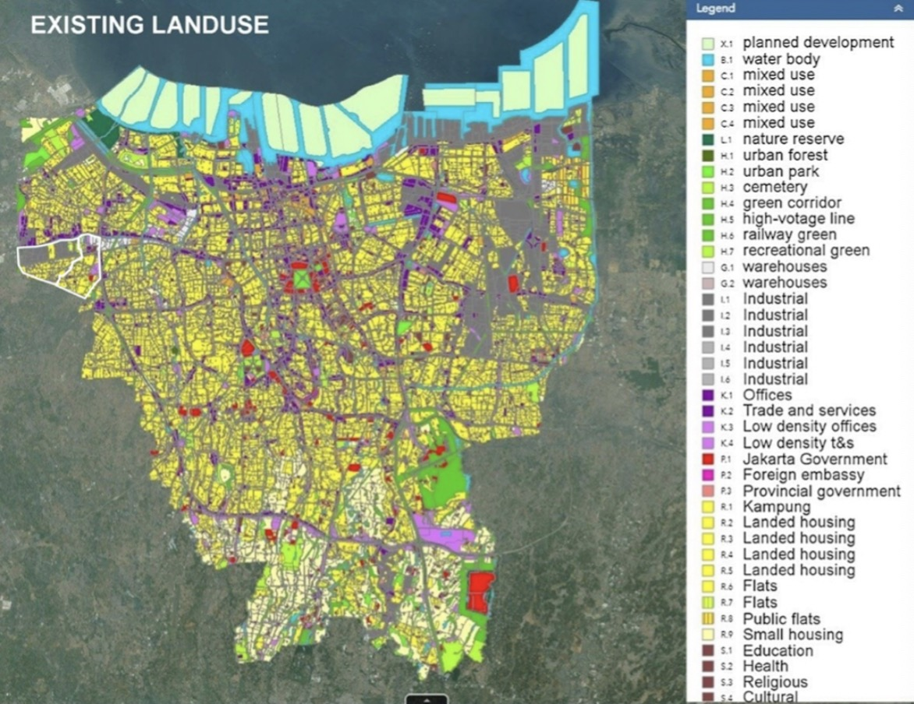

```{r xaringan-themer, include=FALSE, warning=FALSE}
library(xaringanthemer)
style_mono_accent(
  # #1c2653 #527060
  base_color = "#2A4D3A",
  header_font_google = google_font("Josefin Sans"),
  text_font_google   = google_font("Montserrat", "300", "300i"),
  code_font_google   = google_font("Fira Mono"),
)
```

```{css, echo=FALSE}
/* Changing the font size of each slide */

/* the title font size for each slide */
.remark-slide-content h1 {
  font-size: 42px; 
}

.remark-slide-content h2 {
  font-size: 36px; 
}

/*
.remark-slide-content h3 {
  font-size: 24px; */
}
```

```{r xaringan-all, echo=FALSE}
#xaringanExtra::use_scribble() #scribble drawing function, but too lag
xaringanExtra::use_search(show_icon = TRUE, auto_search	=FALSE) #search function
```

```{css, echo=FALSE}
/* Changing the font size of title slide */
.title-slide, .title-slide h1, .title-slide h2 {
  color: #2A4D3A; 
}

.title-slide h3 {
  color: #527060;
}

.title-slide h1 {
  font-size: 52px; 
}

.title-slide h2 {
  font-size: 36px; 
}

.title-slide h3 {
  font-size: 24px; 
}
```

```{css, echo=FALSE}
/* Using selected background image*/
.title-slide {
  background-image: url(images/Jakarta_satellite.PNG);
  background-position: 50% 50%;
  background-size: 100%;
}

/* Adding an white zone for decoration */
.title-slide::before {
  content: "";
  position: absolute;
  top: 10%; 
  left: 0%;
  width: 100%;
  height: 80%; 
  background-color: rgba(255, 255, 255, 0.7); 
  z-index: 1; /* Under the text */
}

/* Adding the decorative icon background */
.title-slide::after {
  content: "";
  position: absolute;
  top: 10%; 
  left: 0;
  width: 100%; 
  height: 80%; 
  background-image: url(images/casalogobw.png); 
  background-size: 135%; 
  background-position: center; 
  z-index: 0; /* Under the text and white zone */
  opacity: 0.3; /* transparent */
}

/* let text is above all */
.title-slide > * {
  position: relative;
  z-index: 2;
}
```


# Jakarta – potential overview

<div style="position: absolute; top: 20px; right: 40px;">
  
</div>


---

# Case Study Global North

<div style="position: absolute; top: 20px; right: 40px;">
  
</div>

.panelset[
.panel[.panel-name[NYC]

.pull-left[
  
  
  <div style="font-size: 14px;"> <!-- The image source font size -->
  blablabla blablabla description blablabla Source: <a
  href="http://sigitkusumawijaya.com/?portfolios=green-boarding-house"
  style="color: #7910FF;">Originally from blabla, picture name</a> <!-- Hyper color -->
  <!-- 额外图源记得写一下描述 -->
  </div>
]

.pull-right[
  * NYC New Green Roof Law
  
  
  * Urban farming has long become common practice on idle plots of land in cities, but today...
  
  * Sigit, who runs his own company named sigit.kusumawijaya, ...
  
  * By function, he says, rooftop gardens brimming with decorative plants...

]

]


.panel[.panel-name[Copenhagen]

.pull-left[
  
  
  <div style="font-size: 14px;"> <!-- The image source font size -->
  blablabla blablabla description blablabla Source: <a
  href="https://en.antaranews.com/news/256325/jakarta-distributes-hydroponic-racks-to-aid-urban-farming-in-pe
  santren"
  style="color: #7910FF;">Originally from blabla, picture name</a> <!-- Hyper color -->
  <!-- 额外图源记得写一下描述 -->
  </div>
]

.pull-right[
  * Jakarta (ANTARA) - The Jakarta Food Security, Marine, and Agriculture (KPKP)...
  
  <br> <!-- 空行做排版，可自行删除 -->
  <br>
  
  
  * "Santri (Islamic boarding school students) can also learn urban farming methods...

]

]


.panel[.panel-name[Chicago]

.pull-left[
  
  
  <div style="font-size: 14px;"> <!-- The image source font size -->
  blablabla blablabla description blablabla Source: <a
  href="https://www.superindo.co.id/korporasi-keberlanjutan/superindoberkebun/gardening_info_detail/soft_openi
  ng_super_indo_berkebun_rooftop_pondok_kelapa_jakarta"
  style="color: #7910FF;">Originally from blabla, picture name</a> <!-- Hyper color -->
  <!-- 额外图源记得写一下描述 -->
  </div>
]

.pull-right[
  Chicago Rooftop Gardening
]

]


]


---
<div style="position: absolute; top: 20px; right: 40px;">
  
</div>

# Case Study/Motivation

```{r xaringan-panelset, echo=FALSE}
xaringanExtra::use_panelset()
```

```{r echo=FALSE}
xaringanExtra::style_panelset_tabs(foreground = "honeydew", background = "seagreen")
# #C6CDF7
```


.panelset[
.panel[.panel-name[Commercial]

.pull-left[
  
  
  <div style="font-size: 14px;"> <!-- The image source font size -->
  blablabla blablabla description blablabla Source: <a
  href="http://sigitkusumawijaya.com/?portfolios=green-boarding-house"
  style="color: #7910FF;">Originally from blabla, picture name</a> <!-- Hyper color -->
  <!-- 额外图源记得写一下描述 -->
  </div>
]

.pull-right[
  * ...A recentpopular development is turning rooftops...
  
  
  * Urban farming has long become common practice on idle plots of land in cities, but today...
  
  * Sigit, who runs his own company named sigit.kusumawijaya, ...
  
  * By function, he says, rooftop gardens brimming with decorative plants...

]

]


.panel[.panel-name[Education]

.pull-left[
  
  
  <div style="font-size: 14px;"> <!-- The image source font size -->
  blablabla blablabla description blablabla Source: <a
  href="https://en.antaranews.com/news/256325/jakarta-distributes-hydroponic-racks-to-aid-urban-farming-in-pe
  santren"
  style="color: #7910FF;">Originally from blabla, picture name</a> <!-- Hyper color -->
  <!-- 额外图源记得写一下描述 -->
  </div>
]

.pull-right[
  * Jakarta (ANTARA) - The Jakarta Food Security, Marine, and Agriculture (KPKP)...
  
  <br> <!-- 空行做排版，可自行删除 -->
  <br>
  
  
  * "Santri (Islamic boarding school students) can also learn urban farming methods...

]

]


.panel[.panel-name[Community]

.pull-left[
  
  
  <div style="font-size: 14px;"> <!-- The image source font size -->
  blablabla blablabla description blablabla Source: <a
  href="https://www.superindo.co.id/korporasi-keberlanjutan/superindoberkebun/gardening_info_detail/soft_openi
  ng_super_indo_berkebun_rooftop_pondok_kelapa_jakarta"
  style="color: #7910FF;">Originally from blabla, picture name</a> <!-- Hyper color -->
  <!-- 额外图源记得写一下描述 -->
  </div>
]

.pull-right[
  Komitmen Super Indo dalam membawa lingkungan dan komunitas yang lebih baik, kini telah berhasil membuka kebun ke-5 nya dengan konsep paling kekinian. Konsep berkebun di rooftop menjadi salah satu metode berkebun Urban Farming bagi sebagian masyarakat Jakarta yang memiliki lahan sempit dan terbatas. Cara ini tentunya membantu masyarakat dalam berbudidaya tanaman di perkotaan dengan memanfaatkan lahan semaksimal mungkin.

]

]


]


---
<div style="position: absolute; top: 20px; right: 40px;">
  
</div>

# Remote Sensing for Rooftop Farming

## City:
Jakarta, Indonesia

## Problem Definition:
`symbiotic coexistence of built environment and nature` <!-- 这里得想一个具体的prob defn -->
<!-- `...` 这个``是强调符号，可以不用，也可以用其他的方式 -->

<span style="color: red; font-weight: bold;">
  symbiotic coexistence of built environment and nature
</span> <!-- 比如这种红色加粗 -->

Food Insecurity: Despite being a bustling metropolis, Jakarta still faces issues of food insecurity, particularly among low-income communities. Limited access to nutritious food, high food prices, and inadequate distribution systems contribute to this problem.  The city experiences a reduction in agricultural land converted into settlements and industrial land, as well as soil deterioration.

Heat Island:...

Air Pollution:...


---
<div style="position: absolute; top: 20px; right: 40px;">
  
</div>

# Current Policy

* In 2017, the city of Jakarta initiated a peri-urban farming program under its Urban Agriculture Program that aimed to achieve sustainable agricultural production, rural economic sustainability and long-term environmental sustainability.

* Gubernatorial Regulation number 14/2018 on Implementation of Urban Farming and Great Design of Urban Farming 2018-2030. (6)

* President Regulation No. 60 2020 on urban farming can also preserve around 30% of open spaces, both for public use (20%) and for private use (10%). (8)

* Medium-Term Regional Medium-Term Plan (RPJMD) for 2007-2012, Jakarta (1) Spatial Planning Jakarta 2030. (1)


---
<div style="position: absolute; top: 20px; right: 40px;">
  
</div>

# SDG alignment

<!-- write a three columns style -->
<style>
  .three-cols {
    display: flex;
    justify-content: space-between;
    text-align: left;
  }
  
  .three-cols > div {
    flex-basis: 30%; /* Adjust this value based on your content and spacing needs */
    margin: 0 1%; /* Adds a little space between columns */
  }
</style>

<div class="three-cols">
  <div>
    <!-- Left SDG 2 -->
    
    <p>Text description for image 1.</p>
  </div>
  <div>
    <!-- Middle SDG 13 -->
    
    <p>Text description for image 2.</p>
  </div>
  <div>
    <!-- Right SDG 15 -->
    
    <p>Text description for image 3.</p>
  </div>
</div>


<div style="font-size: 14px;"> <!-- The image source font size -->
  blablabla blablabla description blablabla Source: <a href="https://www.globalgoals.org/goals/"
  style="color: #7910FF;">Originally from blabla, picture name</a> <!-- Hyper color -->
  <!-- 额外图源记得写一下描述 -->
</div>


---
# Project Data Source

<div style="position: absolute; top: 20px; right: 40px;">
  
</div>


---
<div style="position: absolute; top: 20px; right: 40px;">
  
</div>

# Value and Data Flow

.panelset[
.panel[.panel-name[Data Value]


.panel[.panel-name[Data Flow]


]
]
]


---
<div style="position: absolute; top: 20px; right: 40px;">
  
</div>

# Methodology Overview


---

# Data Architecture

<div style="position: absolute; top: 20px; right: 40px;">
  
</div>


---
<div style="position: absolute; top: 20px; right: 40px;">
  
</div>

# Existing Landuse | Demo Video

.pull-left[
  
  
  <div style="font-size: 14px;"> <!-- The image source font size -->
  blablabla blablabla description blablabla Source: <a
  href="https://tataruang.jakarta.go.id"
  style="color: #7910FF;">Originally from blabla, picture name</a> <!-- Hyper color -->
  <!-- 额外图源记得写一下描述 -->
  </div>
]

.pull-right[
Possible Land Use:

Government

Cultural

Education

]


---
<div style="position: absolute; top: 20px; right: 40px;">
  
</div>

# Project Analysis

.panelset[
.panel[.panel-name[SWOT]

### Strengths
### Weakness
### Opportunities
### Threat

]

.panel[.panel-name[Feasibility]

### Technical - T
### Economic - E
### Legal - L
### Operational - O
### Scheduling - S

]


]


---
<div style="position: absolute; top: 20px; right: 40px;">
  
</div>

# Project Planning


.panelset[
.panel[.panel-name[Workpack]


]

.panel[.panel-name[WBS]


]

.panel[.panel-name[Gantt Chart]


]


]


---
<div style="position: absolute; top: 20px; right: 40px;">
  
</div>

# Budget Breakdown


---
<div style="position: absolute; top: 20px; right: 40px;">
  
</div>

# Prototype Preview

Part of the source data are published [here](https://ee-derekding727.projects.earthengine.app/view/jakartabuidlingandndvilookup) for preview.


<iframe width="800" height="430" src="https://www.youtube.com/embed/iyGOVL74P30?si=MIp52Ks1F9r2Ypmh" title="YouTube video player" frameborder="0" allow="accelerometer; autoplay; clipboard-write; encrypted-media; gyroscope; picture-in-picture; web-share" allowfullscreen></iframe>

---
<div style="position: absolute; top: 20px; right: 40px;">
  
</div>

# Limitation

.panelset[
.panel[.panel-name[Data Source]
### Potential Issues
Visual signal might not contribute to the understanding of the physical structure.
(Data of some variables such as structural load capacity is difficult to obtain.）

### Mitigation 
* Consulting with civil and structural experts.
* Conducting a field investigation.

]


.panel[.panel-name[Model]
### Potential Issues
* Various factors may occasionally hinder the performance of the model.
<br>
<br>
<br>

### Mitigation
* Remote assistant (reset model, calibration, etc)
* On-site

]


.panel[.panel-name[Regulation]
### Potential Issues
* Governance: Local policies (bylaws) could potentially lead to some areas being inaccessible for results.
* Privacy: The outcomes may encroach upon private spaces, leading to reluctance.
<br>
<br>
<br>

### Mitigation 
* Proactive and early stakeholder engagement
* Actively engage public opinion through transparent channels

]


.panel[.panel-name[Uncontrollable Factors]

### Potential Issue
* Unforeseen staff turnover.
* Equipment failures.
* Workload fluctuations.


### Mitigation
* Alternative Personnel Reserve list, Cross-trained.
* Regular maintenance.
* Buffer time, Additional plan.

]


]


---
<div style="position: absolute; top: 20px; right: 40px;">
  
</div>

# Contributions and Outlook

1. Push test


---
<div style="position: absolute; top: 20px; right: 40px;">
  
</div>

# Reference

1. Push test


---

class: inverse, center, middle

# Thanks!

