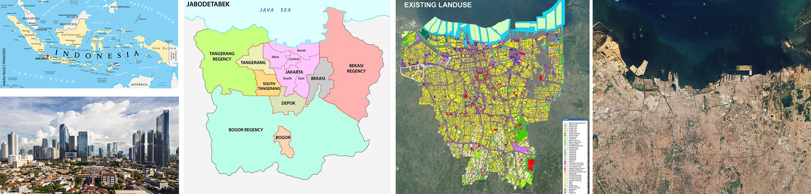
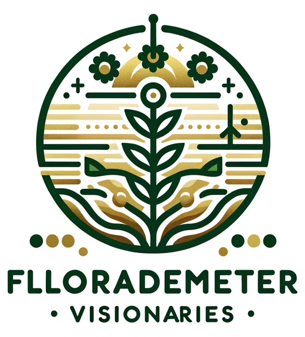
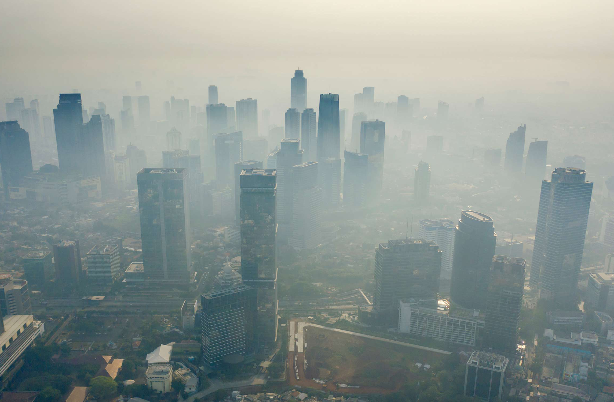
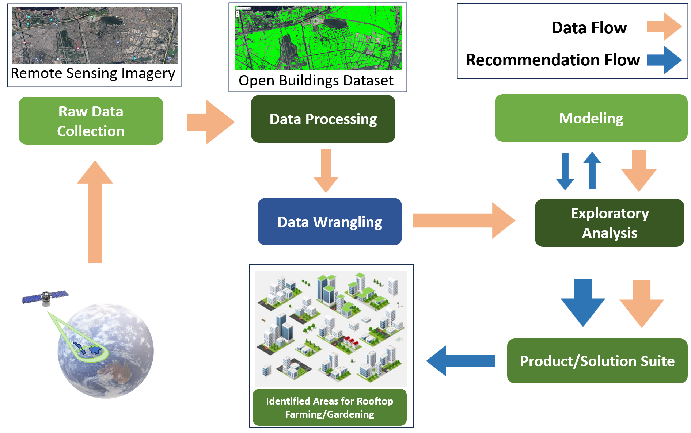
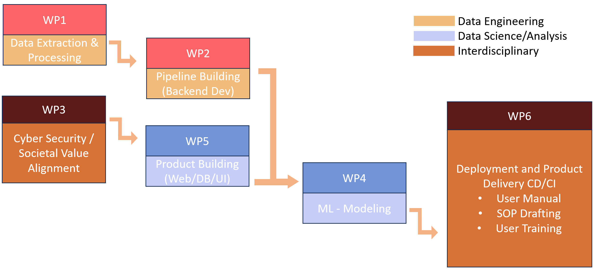

```{r xaringan-themer, include=FALSE, warning=FALSE}
library(xaringanthemer)
style_mono_accent(
  # #1c2653 #527060
  base_color = "#2A4D3A",
  header_font_google = google_font("Josefin Sans"),
  text_font_google   = google_font("Montserrat", "300", "300i"),
  code_font_google   = google_font("Fira Mono"),
)
```

```{r setup, include=FALSE}
options(htmltools.dir.version = FALSE)
```

```{css, echo=FALSE}
/* Changing the font size of each slide */

/* the title font size for each slide */
.remark-slide-content h1 {
  font-size: 42px; 
}

.remark-slide-content h2 {
  font-size: 36px; 
}

/*
.remark-slide-content h3 {
  font-size: 24px; */
}
```

```{r xaringan-all, echo=FALSE}
#xaringanExtra::use_scribble() #scribble drawing function, but too lag
xaringanExtra::use_search(show_icon = TRUE, auto_search	=FALSE) #search function
```

```{css, echo=FALSE}
/* Changing the font size of title slide */
.title-slide, .title-slide h1, .title-slide h2 {
  color: #2A4D3A; 
}

.title-slide h3 {
  color: #527060;
}

.title-slide h1 {
  font-size: 52px; 
}

.title-slide h2 {
  font-size: 36px; 
}

.title-slide h3 {
  font-size: 24px; 
}
```

```{css, echo=FALSE}
/* Using selected background image*/
.title-slide {
  background-image: url(images/Jakarta_satellite.PNG);
  background-position: 50% 50%;
  background-size: 100%;
}

/* Adding an white zone for decoration */
.title-slide::before {
  content: "";
  position: absolute;
  top: 10%; 
  left: 0%;
  width: 100%;
  height: 80%; 
  background-color: rgba(255, 255, 255, 0.7); 
  z-index: 1; /* Under the text */
}

/* Adding the dcorative icon backgrounde */
.title-slide::after {
  content: "";
  position: absolute;
  top: 10%; 
  left: 0;
  width: 100%; 
  height: 80%; 
  background-image: url(images/casalogobw.png); 
  background-size: 135%; 
  background-position: center; 
  z-index: 0; /* Under the text and white zone */
  opacity: 0.3; /* transparent */
}

/* let text is above all */
.title-slide > * {
  position: relative;
  z-index: 2;
}
```


# Location


### Jakarta, Indonesia

* Jakarta is the nation's **capital city** and the centre of the **largest metropolis** of Indonesia.

* Jakarta covers **661.23 sq.km.** and has a population of **10,679,951** as of mid-2022.


* Jakarta is the **economic**, **cultural**, and **political centre** of Indonesia.


<div style="display: flex; justify-content: center;">
  <div style="flex: 1; margin-right: 10px;">
    
</div>
  


<div style="position: absolute; top: 20px; right: 40px;">
  
</div>


---


# Problem Definition


.panelset[


.panel[.panel-name[Air Pollution]


.pull-left[


#### Severity：


Jakarta was again ranked **the most polluted city** in the world by Swiss technology company IQAir.

In early 2023, air pollution potentially caused more than **10,000** deaths, more than **5,000** hospitalizations for cardio-respiratory diseases, and more than **7,000** adverse health outcomes in children each year in Jakarta. The total economic burden attributable to air pollution was estimated to be US$ **2.9** billion. 


]


.pull-right[
  
  


]

]


.panel[.panel-name[Heat Island]

.pull-left[

#### Increase in area:

Previous research shows the area of UHI, in Jakarta in 1989 reached **84.53 sq.km.** or **0.1 %** of the total area. The areas of UHI Jakarta were **36.5%**, **84.7%**, and **85.2%** of the total areas respectively in 2008, 2013 and 2018. 


#### Increase in temperature:

The results show that the SUHI intensity is approximately **3°C–6°C** and AUHI is approximately **1°C–2.5 °C**.


]
.pull-right[
  

<div style="font-size: 14px;"> <!-- The image source font size -->
  Source: <a
  href="https://www.researchgate.net/figure/Map-of-distribution-of-surface-temperature-of-Jakarta-in-year-2001-and-2014_fig4_301317835"
  style="color: #7910FF;">Map of distribution of surface temperature of Jakarta in year 2001 and 2014   </a> <!-- Hyper color -->
  <!-- 额外图源记得写一下描述 -->
  </div>

]

]


.panel[.panel-name[Food Insecurity]


.pull-left[
#### Poverty:

**3.48 %** of Jakarta’s residents – over **312,180** people – fall below the poverty line. **High food prices** and **inadequate distribution** systems cause **low-income communities** have limited access to nutritious food.  


#### Supply:

Jakarta experiences a **agricultural land reduction**. 

Flood happened recently in **1996**, **1999**, **2007**, **2013**, and **2020**. These special events poses challenges to the city's food supply.
]


.pull-right[
  

<div style="font-size: 14px;"> <!-- The image source font size -->
  Source: <a
  href="https://www.plantagbiosciences.org/people/rob-o-hagan/2017/08/29/the-state-of-food-security-in-indonesia-and-west-java/"
  style="color: #7910FF;">The Food Security and Vulnerability Atlas of Indonesia (FSVA) 2015 </a> <!-- Hyper color -->
  <!-- 额外图源记得写一下描述 -->
  </div>

]


]


]


<div style="position: absolute; top: 20px; right: 40px;">
  
</div>


---


class: inverse, middle, left


# Objective:
# Symbiotic coexistence of built environment and nature


---


# SDG Alignment


<!-- write a three columns style -->
<style>
  .three-cols {
    display: flex;
    justify-content: space-between;
    text-align: left;
  }
  
  .three-cols > div {
    flex-basis: 30%; /* Adjust this value based on your content and spacing needs */
    margin: 0 1%; /* Adds a little space between columns */
  }
</style>

<div class="three-cols">
  <div>
    <!-- Left SDG 2 -->
    
    <p>ZERO HUNGER (SDG 2)</p>
    End hunger and ensure year-round access to safe, nutritious and sufficient food</p>
  </div>
  <div>
    <!-- Middle SDG 13 -->
    
    <p>Climate action for adaptation, resilience and mitigation (SDG 13)</p>
    improvement Air quality</p>
  </div>
  <div>
    <!-- Right SDG 15 -->
    
    <p>Green space, habitats and biodiversity (SDG 15)</p>
    Green space creation and/or management</p>
  </div>
</div>


<div style="font-size: 14px;"> <!-- The image source font size -->
  <p>Source: <a href="https://www.globalgoals.org/goals/"
  style="color: #7910FF;"> The Global Goals </a> <!-- Hyper color -->
  <!-- 额外图源记得写一下描述 -->
</div>


<div style="position: absolute; top: 20px; right: 40px;">
  
</div>


---


# Case Study / Global North


<div style="position: absolute; top: 20px; right: 40px;">
  
</div>

.panelset[
.panel[.panel-name[NYC]

.pull-left[
  
  
  <div style="font-size: 14px;"> <!-- The image source font size -->
  Vice Media’s 15,000sf green roof by Brooklyn Grange. Source: <a
  href="https://www.brooklyngrangefarm.com/commercial/vice-media"
  style="color: #7910FF;">Brooklyn Grange</a> <!-- Hyper color -->
  <!-- 额外图源记得写一下描述 -->
  </div>
]

.pull-right[
  
  * Policy Instruments: Tax Abatement Eligibility (PTA3).
  
  
  * Legislation: Local Law 92 of 2019 and Local Law 94 of 2019: Green and Solar Roof Requirements for New Buildings and Complete Roof Replacements. Source: <a
  href="https://www.nyc.gov/assets/buildings/pdf/green_roof_solar_ll92-n-94of2019_sn.pdf"
  style="color: #7910FF;">New York Buildings</a>
  
  
  * Analysis by Tong et al. (2016) indicates a 7% to 33% PM2.5 reduction in the selected neighbourhood in Brooklyn.
  
  
  * City-wide initiative launched by NYC Department of City Planning:<a
  href="https://www.nyc.gov/site/agriculture/faqs/frequently-asked-questions.page"
  style="color: #7910FF;"> Zone Green</a>, estimated to improve urban resilience, improve well-being and quality of life.(Beaupre, 2017)

]

]


.panel[.panel-name[Manchester]

.pull-left[
  
  
  <div style="font-size: 14px;"> <!-- The image source font size -->
  Roof level innovation offers climate resilient vision for Manchester Source: <a
  href="https://www.polypipe.com/news/roof-level-innovation-offers-climate-resilient-vision-manchester"
  style="color: #7910FF;">Originally from Civils & Green Urbanisation, Rooftop Greening in Mancity</a> <!-- Hyper color -->
  <!-- 额外图源记得写一下描述 -->
  </div>
]

.pull-right[
  * Manchester developed a green roof strategy- Sustainable Cities: Options for Responding to Climate Change Impacts and Outcomes (SCORCHIO). 
  
  
  * Partnering with Manchester University, the project utilised an Urban Heat Island map to identify city areas susceptible to elevated temperatures exacerbated by climate change. 
  
  
  * Public buildings were selected as pilot projects for green roof retrofitting, focusing on reducing the heat island effect and air pollution. 
  
  <br> <!-- 空行做排版，可自行删除 -->
  <br>


]

]


.panel[.panel-name[Washington D.C.]

.pull-left[
  
  
  <div style="font-size: 14px;"> <!-- The image source font size -->
   Rooftop Gardening in Washington D.C.Source: <a
  href="https://land8.com/washington-d-c-leads-north-americas-10-green-roof-industry-growth-of-2013/"
  style="color: #7910FF;">Originally from Green Roofs for Healthy Cities (GRHC), Green Roofs</a> <!-- Hyper color -->
  <!-- 额外图源记得写一下描述 -->
  </div>
]

.pull-right[
  * Incentive programs, the one launched in Washington D.C., offer financial support to building owners for installing green roofs, providing up to $15 per square foot in certain areas (Rudzinskas, Lutz, & McElhinney, 2017).
  
  
  * These policies aim to lower the upfront costs of green roof installation, making it a more feasible option for improving air quality, reducing air pollution and heat island effect. 

]

]


]


---

class: inverse, middle, left

# Solution:

# Rooftop Farming and Gardening


---


# Prospective Outcomes


.panelset[


.panel[.panel-name[Air polution]


#### Air Quality Improvement

Rooftop gardens can help to improve air quality by capturing airborne pollutants and particulate matter. By filtering pollutants from the air, rooftop gardens contribute to a healthier urban environment, which can indirectly contribute to cooling effects by reducing the formation of smog and haze.


]


.panel[.panel-name[Food Insecurity]


#### Improved Food Security and Self-sufficiency

Rooftop agriculture enhances urban food security, reducing reliance on external food supplies. Growing food within the city also reduces food transportation distances, thereby lowering carbon emissions.

#### Sponge city

Rooftop agriculture can improve urban water resource management by collecting and utilizing rainwater, reducing pressure on stormwater runoff and drainage systems.


]


.panel[.panel-name[Heat Island]


#### Cooling city

Rooftop gardening adds vegetation to otherwise heat-absorbing surfaces, such as rooftops, which helps to reduce the heat island effect by providing shade and evaporative cooling. Plants release water vapor through a process called transpiration. This evaporation process has a cooling effect, similar to sweating in humans. 


]


.panel[.panel-name[Well being]


#### Urban Greening

Rooftop agriculture contributes to increasing green spaces in cities, improving the urban environment, enhancing air quality, and providing more leisure areas for city dwellers.


#### Community Engagement and Social Connection

Rooftop agriculture projects often attract community participation, fostering community cooperation and connections, and increasing urban residents' awareness of and involvement in food production.


]


]


<div style="position: absolute; top: 20px; right: 40px;">
  
</div>


---


# Current Policy


### Air Pollution

* **Strategy for Air Pollution Control** (SPPU)

* **Green open space masterplan at Jakarta Capital City**, Indonesia for climate change mitigation. Jakarta Government Plans to Add **800** Green Open Spaces to Deal with Air Pollution in 2023.


### Urban Agriculture


* In 2017, the city of Jakarta initiated a **peri-urban farming program** under its **Urban Agriculture Program** that aimed to achieve sustainable agricultural production, rural economic sustainability and long-term environmental sustainability.


<div style="position: absolute; top: 20px; right: 40px;">
  
</div>


---


# Case Study / Jarkada

```{r xaringan-panelset, echo=FALSE}
xaringanExtra::use_panelset()
```

```{r echo=FALSE}
xaringanExtra::style_panelset_tabs(foreground = "honeydew", background = "seagreen")
# #C6CDF7
```


.panelset[
.panel[.panel-name[Commercial]

.pull-left[
  
  
  
]

.pull-right[


#### sigit.kusumawijaya

* A recentpopular development is turning rooftops into dining areas,such as **cafes**, **bars** or **restaurants**.


* The demand comes not only from clients in **Jakarta** but also from other cities, such as **Yogyakarta**, and from **Bali**.


* Driven by a healthy lifestyle, many now also focus on productive plants, such as **water spinach**, **spinach**, **tomatoes**, **chilies** and etc


]

]


.panel[.panel-name[Education]

.pull-left[
  
  
  
]

.pull-right[
  

#### Santri


* The Jakarta Food Security, Marine, and Agriculture (KPKP) Office distributed **hydroponic racks** to facilitate urban farming in several Islamic boarding **schools** under the framework of National Santri Day 2022


* Santri (Islamic boarding school students) can also learn urban farming methods and produce local food products by utilizing the limited land as well as participate in the movement to realize independent food security in Indonesia," she stated.


]

]


.panel[.panel-name[Community]

.pull-left[
  
  
 
]

.pull-right[


#### Super Indo


* Committed to creating a better environment and community, Super Indo has now successfully opened its **fifth** garden with the most modern concept.


]

]


]


<div style="position: absolute; top: 20px; right: 40px;">
  
</div>


---


class: inverse, middle, left


# Methodology:
# Using Remote Sensing for Identifying Rooftop Farming/Gardening Potentials in Jakarta


---
<div style="position: absolute; top: 20px; right: 40px;">
  
</div>

# Methodology Overview
<p align="center">

</p>


---

# Modeling Architecture

<div style="position: absolute; top: 20px; right: 40px;">
  
</div>

<p align="center">

</p>

---
# Project Data Source 1

<div style="position: absolute; top: 20px; right: 40px;">
  
</div>


 <table>
  <tr>
    <td>Data Type</td>
    <td>Potential Dataset</td>
    <td>Access</td>
    <td>Temporal Resolution</td>
    <td>Spatial Resolution</td>
  </tr>
  <tr>
    <td>Building Footprint Data</td>
    <td>Google's Open Buildings Dataset, Jakarta Building Records, Crowd-sourced World-wide Building Footprint (See et al., 2022), BIM (Building Information Model) </td>
    <td>Open-source</td>
    <td>14</td>
    <td>10</td>
  </tr>
  <tr>
    <td>Urban Temperature</td>
    <td>MODIS, Jakarta’s Historical Temperature Data</td>
    <td>Open-source</td>
    <td>14</td>
    <td>10</td>
  </tr>
  <tr>
    <td>Weather</td>
    <td>Global Forecast System (GFS), Jakarta Weather Data</td>
    <td>Open-source</td>
    <td>14</td>
    <td>10</td>
  </tr>
  <tr>
    <td>Rainfall</td>
    <td>Multi-satellite Retrievals for GPM (IMERG), Jakarta ground rainfall records</td>
    <td>Open-source</td>
    <td>14</td>
    <td>10</td>
  </tr>
</table> 
---
# Project Data Source 2

<div style="position: absolute; top: 20px; right: 40px;">
  
</div>

<table>
  <tr>
    <td>Air Quality</td>
    <td>Sentinel-5P, Air quality data of Jakarta</td>
    <td>Open-source</td>
    <td>14</td>
    <td>10</td>
  </tr>
  <tr>
    <td>High resolution Satellite SAR/ Optiacal Imagery</td>
    <td>Landsat 8/9, Sentinel-2/Sentinel-1, and Other Commercial Data</td>
    <td>Open-source</td>
    <td>14</td>
    <td>10</td>
  </tr>
  <tr>
    <td>Other Environment Data</td>
    <td>Humidity, Historical Vegetation Coverage Data, Light Pollution Data etc.</td>
    <td>Open-source</td>
    <td>14</td>
    <td>10</td>
  </tr>
  <tr>
    <td>Existing Land Use Data</td>
    <td>Latest LULC Dataset (Putri, Abadi and Kafafa, 2020)</td>
    <td>Open-source</td>
    <td>14</td>
    <td>10</td>
  </tr>
  <tr>
    <td>Census Data</td>
    <td>14</td>
    <td>Open-source</td>
    <td>14</td>
    <td>10</td>
  </tr>
</table> 


---
<div style="position: absolute; top: 20px; right: 40px;">
  
</div>

# Value and Data Flow

.panelset[
.panel[.panel-name[Data Value]


.panel[.panel-name[Data Flow]



]
]
]


---
<div style="position: absolute; top: 20px; right: 40px;">
  
</div>

# Project Analysis

.panelset[
.panel[.panel-name[SWOT]


]

.panel[.panel-name[Feasibility]


]


]


---
<div style="position: absolute; top: 20px; right: 40px;">
  
</div>

# Project Planning


.panelset[
.panel[.panel-name[Workpack Breakdown]
<p align="center">

</p>
]

.panel[.panel-name[WBS]


]

.panel[.panel-name[Gantt Chart]

<p align="center">


</p>
]


]


---
<div style="position: absolute; top: 20px; right: 40px;">
  
</div>

# Budget Breakdown

.panelset[
.panel[.panel-name[Personnel Budget]


]

.panel[.panel-name[Other Budget]


]


]


---


# Prototype Preview

Part of the source data are published [here](https://ee-derekding727.projects.earthengine.app/view/jakartabuidlingandndvilookup) for preview.

<p align="center">

<iframe width="800" height="430" src="https://www.youtube.com/embed/iyGOVL74P30?si=MIp52Ks1F9r2Ypmh" title="YouTube video player" frameborder="0" allow="accelerometer; autoplay; clipboard-write; encrypted-media; gyroscope; picture-in-picture; web-share" allowfullscreen></iframe>

</p>


<div style="position: absolute; top: 20px; right: 40px;">
  
</div>


---
<div style="position: absolute; top: 20px; right: 40px;">
  
</div>

# Limitations and Risks

.panelset[
.panel[.panel-name[Data Source]
### Potential Issues
* Visual signal might not contribute to the understanding of the physical structure. <span style="color: red; font-weight: bold;">Roof load bearing capacity data</span> might be difficult to obtain.

### Mitigation 
* Consulting with <span style="color: blue; font-weight: bold;">civil</span> and <span style="color: blue; font-weight: bold;">structural experts</span>.

* Conducting a <span style="color: blue; font-weight: bold;">field investigation</span>.

]


.panel[.panel-name[Model]
### Potential Issues
* Various factors may occasionally hinder the performance of the model.
<br>


### Mitigation
* Remote assistant (reset model, calibration, etc)
* On-site

]


.panel[.panel-name[Regulation]
### Potential Issues
* <span style="color: red; font-weight: bold;">Governance:</span> <span style="color: red; font-weight: bold;">Local policies (bylaws)</span> could potentially lead to some areas being <span style="color: red; font-weight: bold;">inaccessible for results</span>.

* <span style="color: red; font-weight: bold;">Privacy:</span> The outcomes may <span style="color: red; font-weight: bold;">encroach upon private spaces</span>, leading to reluctance.
<br>


### Mitigation 
* <span style="color: blue; font-weight: bold;">Early engagement with stakeholders</span> involves them in the decision-making process through community workshops, online forums, etc.


* Actively engage with <span style="color: blue; font-weight: bold;">public opinion</span> and incorporate <span style="color: blue; font-weight: bold;">community feedback</span> through public consultation, social media interactions, etc.

]


.panel[.panel-name[Uncontrollable Factors]

### Potential Issues
* Unforeseen staff turnover.

* Equipment failures.

* Workload fluctuations.


### Mitigation
* Alternative Personnel Reserve list, Cross-trained.

* Regular maintenance.

* Buffer time, Additional plan.

]


]


---
<div style="position: absolute; top: 20px; right: 40px;">
  
</div>

# Contributions

.pull-left[
### Main contributions
* Holistic solution for Jakarta: Rooftop Farming and Gardening, with a primary emphasis on significantly reducing air pollution.

* Directly target **air quality improvement** to tackle urban pollution effectively.

* Additionally, mitigate the Urban Heat Island Effect and **enhance urban climate resilience**.

* Indirectly **address potential food insecurity** through urban agriculture initiatives.

* **Share insights and data**: Rooftop Index + Open-source our dataset and model.


]

.pull-right[
### Other contributions
* Drive <span style="color: blue; font-weight: bold;">economic growth</span>
  * potential increase in <span style="color: blue; font-weight: bold;">job opportunities</span> and <span style="color: blue; font-weight: bold;">economic activities</span>
  
  * <span style="color: blue; font-weight: bold;">urban regeneration</span> (develop attractions, building price appreciation, etc)
  
* Effectively utilizing <span style="color: blue; font-weight: bold;">urban spaces</span>

* Engage with the <span style="color: blue; font-weight: bold;">Quadruple Helix</span>

]


---
<div style="position: absolute; top: 20px; right: 40px;">
  
</div>

# Outlook

<br>

* Delving deeper into <span style="color: blue; font-weight: bold;">Rooftop Agriculture</span>.
  * Fine-grained recognition
  
  * Our Rooftop index + Assigning optimal crops

<br>

* Our method has <span style="color: blue; font-weight: bold;">high reproducibility</span> and can be applied to other similar cities.

<br>

* <span style="color: blue; font-weight: bold;">Rooftop vegetation efficacy monitoring and evaluation</span>
  * Feedback for continuous urban temperature and air quality improvement.
  
  * Based on feedback, optimizing the model.
  
  
---
<div style="position: absolute; top: 20px; right: 40px;">
  
</div>

# Reference

1. Push test


---

class: inverse, center, middle

# Thanks!

