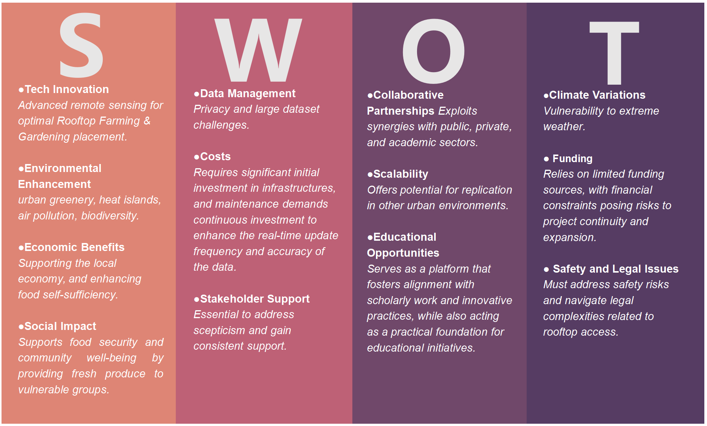
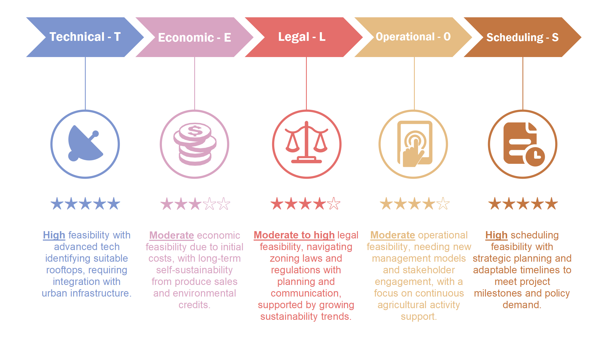
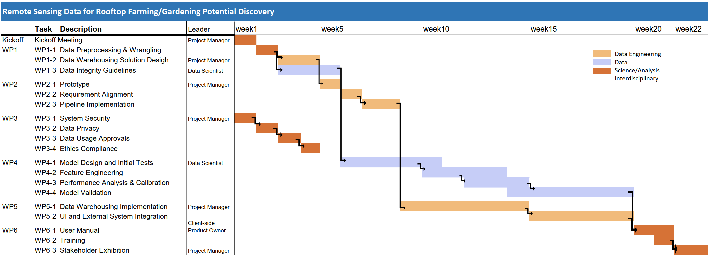

```{r xaringan-themer, include=FALSE, warning=FALSE}
library(xaringanthemer)
style_mono_accent(
  # #1c2653 #527060
  base_color = "#2A4D3A",
  header_font_google = google_font("Josefin Sans"),
  text_font_google   = google_font("Montserrat", "300", "300i"),
  code_font_google   = google_font("Fira Mono"),
)
```

```{r setup, include=FALSE}
options(htmltools.dir.version = FALSE)
```

```{css, echo=FALSE}
/* Changing the font size of each slide */

/* the title font size for each slide */
.remark-slide-content h1 {
  font-size: 42px; 
}

.remark-slide-content h2 {
  font-size: 36px; 
}

/*
.remark-slide-content h3 {
  font-size: 24px; */
}
```

```{r xaringan-all, echo=FALSE}
#xaringanExtra::use_scribble() #scribble drawing function, but too lag
xaringanExtra::use_search(show_icon = TRUE, auto_search	=FALSE) #search function
```

```{css, echo=FALSE}
/* Changing the font size of title slide */
.title-slide, .title-slide h1, .title-slide h2 {
  color: #2A4D3A; 
}

.title-slide h3 {
  color: #527060;
}

.title-slide h1 {
  font-size: 52px; 
}

.title-slide h2 {
  font-size: 36px; 
}

.title-slide h3 {
  font-size: 24px; 
}
```

```{css, echo=FALSE}
/* Using selected background image*/
.title-slide {
  background-image: url(images/Jakarta_satellite.PNG);
  background-position: 50% 50%;
  background-size: 100%;
}

/* Adding an white zone for decoration */
.title-slide::before {
  content: "";
  position: absolute;
  top: 10%; 
  left: 0%;
  width: 100%;
  height: 80%; 
  background-color: rgba(255, 255, 255, 0.7); 
  z-index: 1; /* Under the text */
}

/* Adding the decorative icon background */
.title-slide::after {
  content: "";
  position: absolute;
  top: 10%; 
  left: 0;
  width: 100%; 
  height: 80%; 
  background-image: url(images/casalogobw.png); 
  background-size: 135%; 
  background-position: center; 
  z-index: 0; /* Under the text and white zone */
  opacity: 0.3; /* transparent */
}

/* let text is above all */
.title-slide > * {
  position: relative;
  z-index: 2;
}
```


---


background-image: url("images/cover.jpg")
background-position: 50% 50%
class: center, bottom, inverse


---
# Issue Identification


### City: Jakarta, Indonesia

Jakarta is a member of the Asian Network of Major Cities 21, C40 Cities Climate Leadership Group and ASEAN Smart Cities Network.

<div style="display: flex; justify-content: center;">
  <div style="flex: 1; margin-right: 10px;">
    

</div>


<div style="position: absolute; top: 20px; right: 40px;">
  
</div>


---


## Problem：

.panelset[
.panel[.panel-name[Food Insecurity]


#### Poor population:
Official statistics indicate that **3.48 %** of Jakarta’s residents – over 312,180 people – fall below the poverty line. Despite being a bustling metropolis, Jakarta still faces issues of food insecurity, particularly among low-income communities. 


#### Food supply chain:
Limited access to nutritious food, high food prices, and inadequate distribution systems contribute to this problem.  


#### Land use:
The city experiences a reduction in agricultural land converted into settlements and industrial land, as well as soil deterioration.​

]

.panel[.panel-name[Heat Island]


#### Increase in area:

Previous research shows the area of UHI, areas with temperatures> **300**, in Jakarta in 1989 reached **84.53 sq.km.** or **0.1 %** of the total area. Meanwhile, the decreased number of waters, vegetation, and agriculture area was observed during 2000-2019, followed by the increased number of residence and industry areas. The areas of UHI Jakarta were **36.5%**, **84.7%**, and **85.2%** of the total areas respectively in 2008, 2013 and 2018. 


#### Increase in temperature:

The results show that the SUHI intensity is approximately **3°C–6°C** and AUHI is approximately **1°C–2.5 °C**.


.normal-font[
Source: [Jakarta urban heat Island](https://www-sciencedirect-com.libproxy.ucl.ac.uk/science/article/pii/S2352938523001441)
]


]


.panel[.panel-name[Air Pollution]


#### Vehicle emissions:

The heavy traffic congestion in Jakarta contributes to poor air quality, with high levels of vehicle emissions and industrial pollutants. This pollution poses health risks to residents and has adverse effects on the environment.


]

]


<div style="position: absolute; top: 20px; right: 40px;">
  
</div>


---


# SDG Alignment


<!-- write a three columns style -->
<style>
  .three-cols {
    display: flex;
    justify-content: space-between;
    text-align: left;
  }
  
  .three-cols > div {
    flex-basis: 30%; /* Adjust this value based on your content and spacing needs */
    margin: 0 1%; /* Adds a little space between columns */
  }
</style>

<div class="three-cols">
  <div>
    <!-- Left SDG 2 -->
    
    <p>ZERO HUNGER (SDG 2)</p>
    End hunger and ensure year-round access to safe, nutritious and sufficient food</p>
  </div>
  <div>
    <!-- Middle SDG 13 -->
    
    <p>Climate action for adaptation, resilience and mitigation (SDG 13)</p>
    improvement Air quality</p>
  </div>
  <div>
    <!-- Right SDG 15 -->
    
    <p>Green space, habitats and biodiversity (SDG 15)</p>
    Green space creation and/or management</p>
  </div>
</div>


<div style="font-size: 14px;"> <!-- The image source font size -->
  <p>Source: <a href="https://www.globalgoals.org/goals/"
  style="color: #7910FF;"> The Global Goals </a> <!-- Hyper color -->
  <!-- 额外图源记得写一下描述 -->
</div>


<div style="position: absolute; top: 20px; right: 40px;">
  
</div>


---


class: inverse, middle, left


# Objective:
# Symbiotic coexistence of built environment and nature


---


# Case Study / Global North


<div style="position: absolute; top: 20px; right: 40px;">
  
</div>

.panelset[
.panel[.panel-name[NYC]

.pull-left[
  
  
  <div style="font-size: 14px;"> <!-- The image source font size -->
  blablabla blablabla description blablabla Source: <a
  href="http://sigitkusumawijaya.com/?portfolios=green-boarding-house"
  style="color: #7910FF;">Originally from blabla, picture name</a> <!-- Hyper color -->
  <!-- 额外图源记得写一下描述 -->
  </div>
]

.pull-right[
  * NYC New Green Roof Law
  
  
  * Urban farming has long become common practice on idle plots of land in cities, but today...
  
  * Sigit, who runs his own company named sigit.kusumawijaya, ...
  
  * By function, he says, rooftop gardens brimming with decorative plants...

]

]


.panel[.panel-name[Copenhagen]

.pull-left[
  
  
  <div style="font-size: 14px;"> <!-- The image source font size -->
  blablabla blablabla description blablabla Source: <a
  href="https://en.antaranews.com/news/256325/jakarta-distributes-hydroponic-racks-to-aid-urban-farming-in-pe
  santren"
  style="color: #7910FF;">Originally from blabla, picture name</a> <!-- Hyper color -->
  <!-- 额外图源记得写一下描述 -->
  </div>
]

.pull-right[
  * Jakarta (ANTARA) - The Jakarta Food Security, Marine, and Agriculture (KPKP)...
  
  <br> <!-- 空行做排版，可自行删除 -->
  <br>
  
  
  * "Santri (Islamic boarding school students) can also learn urban farming methods...

]

]


.panel[.panel-name[Chicago]

.pull-left[
  
  
  <div style="font-size: 14px;"> <!-- The image source font size -->
  blablabla blablabla description blablabla Source: <a
  href="https://www.superindo.co.id/korporasi-keberlanjutan/superindoberkebun/gardening_info_detail/soft_openi
  ng_super_indo_berkebun_rooftop_pondok_kelapa_jakarta"
  style="color: #7910FF;">Originally from blabla, picture name</a> <!-- Hyper color -->
  <!-- 额外图源记得写一下描述 -->
  </div>
]

.pull-right[
  Chicago Rooftop Gardening
]

]


]


---


# Current Policy


### Urban Agriculture


* In 2017, the city of Jakarta initiated a peri-urban farming program under its Urban Agriculture Program that aimed to achieve sustainable agricultural production, rural economic sustainability and long-term environmental sustainability.

* Gubernatorial Regulation number 14/2018 on Implementation of Urban Farming and Great Design of Urban Farming 2018-2030. (6)

* President Regulation No. 60 2020 on urban farming can also preserve around 30% of open spaces, both for public use (20%) and for private use (10%). (8)

* Medium-Term Regional Medium-Term Plan (RPJMD) for 2007-2012, Jakarta (1) Spatial Planning Jakarta 2030. (1)


<div style="position: absolute; top: 20px; right: 40px;">
  
</div>


---


# Case Study / Jarkada

```{r xaringan-panelset, echo=FALSE}
xaringanExtra::use_panelset()
```

```{r echo=FALSE}
xaringanExtra::style_panelset_tabs(foreground = "honeydew", background = "seagreen")
# #C6CDF7
```


.panelset[
.panel[.panel-name[Commercial]

.pull-left[
  
  
  <div style="font-size: 14px;"> <!-- The image source font size -->
  blablabla blablabla description blablabla Source: <a
  href="http://sigitkusumawijaya.com/?portfolios=green-boarding-house"
  style="color: #7910FF;">Originally from blabla, picture name</a> <!-- Hyper color -->
  <!-- 额外图源记得写一下描述 -->
  </div>
]

.pull-right[
  * ...A recentpopular development is turning rooftops...
  
  
  * Urban farming has long become common practice on idle plots of land in cities, but today...
  
  * Sigit, who runs his own company named sigit.kusumawijaya, ...
  
  * By function, he says, rooftop gardens brimming with decorative plants...

]

]


.panel[.panel-name[Education]

.pull-left[
  
  
  <div style="font-size: 14px;"> <!-- The image source font size -->
  blablabla blablabla description blablabla Source: <a
  href="https://en.antaranews.com/news/256325/jakarta-distributes-hydroponic-racks-to-aid-urban-farming-in-pe
  santren"
  style="color: #7910FF;">Originally from blabla, picture name</a> <!-- Hyper color -->
  <!-- 额外图源记得写一下描述 -->
  </div>
]

.pull-right[
  * Jakarta (ANTARA) - The Jakarta Food Security, Marine, and Agriculture (KPKP)...
  
  <br> <!-- 空行做排版，可自行删除 -->
  <br>
  
  
  * "Santri (Islamic boarding school students) can also learn urban farming methods...

]

]


.panel[.panel-name[Community]

.pull-left[
  
  
  <div style="font-size: 14px;"> <!-- The image source font size -->
  blablabla blablabla description blablabla Source: <a
  href="https://www.superindo.co.id/korporasi-keberlanjutan/superindoberkebun/gardening_info_detail/soft_openi
  ng_super_indo_berkebun_rooftop_pondok_kelapa_jakarta"
  style="color: #7910FF;">Originally from blabla, picture name</a> <!-- Hyper color -->
  <!-- 额外图源记得写一下描述 -->
  </div>
]

.pull-right[
  Komitmen Super Indo dalam membawa lingkungan dan komunitas yang lebih baik, kini telah berhasil membuka kebun ke-5 nya dengan konsep paling kekinian. Konsep berkebun di rooftop menjadi salah satu metode berkebun Urban Farming bagi sebagian masyarakat Jakarta yang memiliki lahan sempit dan terbatas. Cara ini tentunya membantu masyarakat dalam berbudidaya tanaman di perkotaan dengan memanfaatkan lahan semaksimal mungkin.

]

]


]


<div style="position: absolute; top: 20px; right: 40px;">
  
</div>


---


class: inverse, middle, left


# Solution:
# Using Remote Sensing for Identifying Rooftop Farming in Jakarta


---
<div style="position: absolute; top: 20px; right: 40px;">
  
</div>

# Methodology Overview


---

# Data Architecture

<div style="position: absolute; top: 20px; right: 40px;">
  
</div>


---
# Project Data Source

<div style="position: absolute; top: 20px; right: 40px;">
  
</div>


---
<div style="position: absolute; top: 20px; right: 40px;">
  
</div>

# Value and Data Flow

.panelset[
.panel[.panel-name[Data Value]


.panel[.panel-name[Data Flow]


]
]
]


---
<div style="position: absolute; top: 20px; right: 40px;">
  
</div>

# Existing Landuse | Demo Video

.pull-left[
  
  
  <div style="font-size: 14px;"> <!-- The image source font size -->
  blablabla blablabla description blablabla Source: <a
  href="https://tataruang.jakarta.go.id"
  style="color: #7910FF;">Originally from blabla, picture name</a> <!-- Hyper color -->
  <!-- 额外图源记得写一下描述 -->
  </div>
]

.pull-right[
Possible Land Use:

Government

Cultural

Education

]


---
<div style="position: absolute; top: 20px; right: 40px;">
  
</div>

# Project Analysis

.panelset[
.panel[.panel-name[SWOT]



]

.panel[.panel-name[Feasibility]



]


]


---
<div style="position: absolute; top: 20px; right: 40px;">
  
</div>

# Project Planning


.panelset[
.panel[.panel-name[Workpack]


]

.panel[.panel-name[WBS]


]

.panel[.panel-name[Gantt Chart]



]


]


---
<div style="position: absolute; top: 20px; right: 40px;">
  
</div>

# Budget Breakdown


---


# Prototype Preview

Part of the source data are published [here](https://ee-derekding727.projects.earthengine.app/view/jakartabuidlingandndvilookup) for preview.


<iframe width="800" height="430" src="https://www.youtube.com/embed/iyGOVL74P30?si=MIp52Ks1F9r2Ypmh" title="YouTube video player" frameborder="0" allow="accelerometer; autoplay; clipboard-write; encrypted-media; gyroscope; picture-in-picture; web-share" allowfullscreen></iframe>


<div style="position: absolute; top: 20px; right: 40px;">
  
</div>


---
<div style="position: absolute; top: 20px; right: 40px;">
  
</div>

# Limitations and Risks

.panelset[
.panel[.panel-name[Data Source]
### Potential Issues
* Visual signal might not contribute to the understanding of the physical structure. <span style="color: red; font-weight: bold;">Roof load bearing capacity data</span> might be difficult to obtain.

### Mitigation 
* Consulting with <span style="color: blue; font-weight: bold;">civil</span> and <span style="color: blue; font-weight: bold;">structural experts</span>.

* Conducting a <span style="color: blue; font-weight: bold;">field investigation</span>.

]


.panel[.panel-name[Model]
### Potential Issues
* Various factors may occasionally hinder the performance of the model.
<br>


### Mitigation
* Remote assistant (reset model, calibration, etc)
* On-site

]


.panel[.panel-name[Regulation]
### Potential Issues
* <span style="color: red; font-weight: bold;">Governance:</span> <span style="color: red; font-weight: bold;">Local policies (bylaws)</span> could potentially lead to some areas being <span style="color: red; font-weight: bold;">inaccessible for results</span>.

* <span style="color: red; font-weight: bold;">Privacy:</span> The outcomes may <span style="color: red; font-weight: bold;">encroach upon private spaces</span>, leading to reluctance.
<br>


### Mitigation 
* <span style="color: blue; font-weight: bold;">Early engagement with stakeholders</span> involves them in the decision-making process through community workshops, online forums, etc.


* Actively engage with <span style="color: blue; font-weight: bold;">public opinion</span> and incorporate <span style="color: blue; font-weight: bold;">community feedback</span> through public consultation, social media interactions, etc.

]


.panel[.panel-name[Uncontrollable Factors]

### Potential Issues
* Unforeseen staff turnover.

* Equipment failures.

* Workload fluctuations.


### Mitigation
* Alternative Personnel Reserve list, Cross-trained.

* Regular maintenance.

* Buffer time, Additional plan.

]


]


---
<div style="position: absolute; top: 20px; right: 40px;">
  
</div>

# Contributions

.pull-left[
### Main contributions

]

.pull-right[
### Other contributions
* Drive <span style="color: blue; font-weight: bold;">economic growth</span>
  * potential increase in <span style="color: blue; font-weight: bold;">job opportunities</span> and <span style="color: blue; font-weight: bold;">economic activities</span>
  
  * <span style="color: blue; font-weight: bold;">urban regeneration</span> (develop attractions, building price appreciation, etc)
  
* Effectively utilizing <span style="color: blue; font-weight: bold;">urban spaces</span>

* Engage with the <span style="color: blue; font-weight: bold;">Quadruple Helix</span>

]


---
<div style="position: absolute; top: 20px; right: 40px;">
  
</div>

# Outlook

<br>

* Delving deeper into <span style="color: blue; font-weight: bold;">Rooftop Agriculture</span>.
  * Fine-grained recognition
  
  * Our Rooftop index + Assigning optimal crops

<br>

* Our method has <span style="color: blue; font-weight: bold;">high reproducibility</span> and can be applied to other similar cities.

<br>

* <span style="color: blue; font-weight: bold;">Rooftop vegetation efficacy monitoring and evaluation</span>
  * Feedback for continuous urban temperature and air quality improvement.
  
  * Based on feedback, optimizing the model.
  
  
---
<div style="position: absolute; top: 20px; right: 40px;">
  
</div>

# Reference

1. Push test


---

class: inverse, center, middle

# Thanks!

