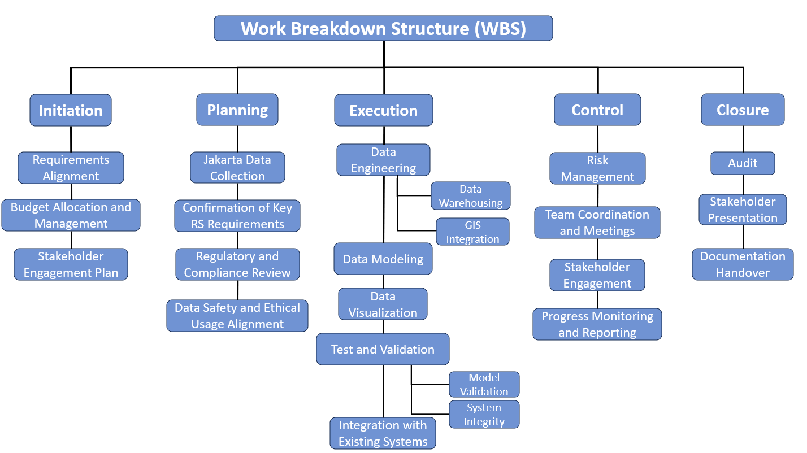

---

  

# Methodology Overview

---

# Data Architecture

  

---
# Project Data Source

  

---

  

# Value and Data Flow

.panelset[
.panel[.panel-name[Data Value]

.panel[.panel-name[Data Flow]

]
]
]

---

  

# Existing Landuse | Demo Video

.pull-left[
  
  
  
 <!-- The image source font size -->
  blablabla blablabla description blablabla Source: <a
  href="https://tataruang.jakarta.go.id"
  style="color: #7910FF;">Originally from blabla, picture name</a> <!-- Hyper color -->
  <!-- 额外图源记得写一下描述 -->
  

]

.pull-right[
Possible Land Use:

Government

Cultural

Education

]

---

  

# Project Analysis

.panelset[
.panel[.panel-name[SWOT]

### Strengths
### Weakness
### Opportunities
### Threat

]

.panel[.panel-name[Feasibility]

### Technical - T
### Economic - E
### Legal - L
### Operational - O
### Scheduling - S

]

]

---

  

# Project Planning

.panelset[
.panel[.panel-name[Workpack]

]

.panel[.panel-name[WBS]

]

.panel[.panel-name[Gantt Chart]

]

]

---

  

# Budget Breakdown

---

# Prototype Preview

Part of the source data are published [here](https://ee-derekding727.projects.earthengine.app/view/jakartabuidlingandndvilookup) for preview.

<iframe width="800" height="430" src="https://www.youtube.com/embed/iyGOVL74P30?si=MIp52Ks1F9r2Ypmh" title="YouTube video player" frameborder="0" allow="accelerometer; autoplay; clipboard-write; encrypted-media; gyroscope; picture-in-picture; web-share" allowfullscreen></iframe>

  

---

  

# Limitations and Risks

.panelset[
.panel[.panel-name[Data Source]
### Potential Issues
Visual signal might not contribute to the understanding of the physical structure.
(Data of some variables such as structural load capacity is difficult to obtain.）

### Mitigation 
* Consulting with civil and structural experts.
* Conducting a field investigation.

]

.panel[.panel-name[Model]
### Potential Issues
* Various factors may occasionally hinder the performance of the model.
 
 
 

### Mitigation
* Remote assistant (reset model, calibration, etc)
* On-site

]

.panel[.panel-name[Regulation]
### Potential Issues
* Governance: Local policies (bylaws) could potentially lead to some areas being inaccessible for results.
* Privacy: The outcomes may encroach upon private spaces, leading to reluctance.
 
 
 

### Mitigation 
* Proactive and early stakeholder engagement
* Actively engage public opinion through transparent channels

]

.panel[.panel-name[Uncontrollable Factors]

### Potential Issues
* Unforeseen staff turnover.
* Equipment failures.
* Workload fluctuations.

### Mitigation
* Alternative Personnel Reserve list, Cross-trained.
* Regular maintenance.
* Buffer time, Additional plan.

]

]

---

  

# Contributions and Outlook

1. Push test

---

  

# Reference

1. Push test

---

class: inverse, center, middle

# Thanks!

